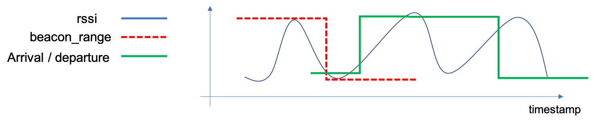

跟据“rider_beacon_447337”和"rider_behavior_447337"两个文件，画出十副如下的图。注意：

* 根据detect_at，每小时一张图。

* 其中447337是rider_id
* 两个表通过rider_id和shop_id来结合
* 每个shop_id对应一个beacon
* 要注意，每张图内可能有多个shop的beacon数据和到店离店数据，最好用不同的颜色把他们画出来。

    

